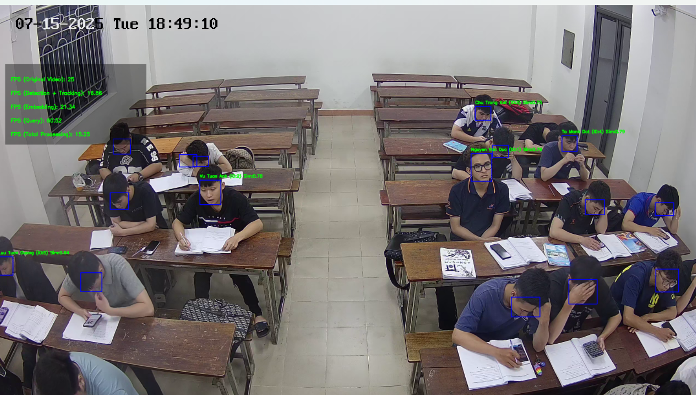

# Face Recognition Video Processor

This project is a video-based face recognition system leveraging advanced Deep Learning techniques. The system integrates Face Detection, Face Embedding, and Face Recognition to identify individuals in videos, supporting both real-time and offline processing.

## Demo Result



## Key Features

- **Face Detection**: Uses YOLOv8-Face model for fast and accurate face detection.
- **Feature Extraction**: Utilizes InsightFace (Buffalo_L) to generate face embedding vectors.
- **Face Recognition**:
  - Uses FAISS for high-speed similarity search.
  - Supports multiple labeling strategies: `soft` (ratio-based), `hard` (voting-based).
  - Tracking mechanism with label confidence updates over time.
- **High Performance**:
  - Supports GPU acceleration (CUDA).
  - Optimized for batch processing.
  - Configurable frame skipping to increase processing speed.
- **Visual Display**:
  - Draws bounding boxes and identified names on the video.
  - Displays detailed FPS for each stage (Detect, Embed, Query).

## Installation Requirements

Ensure Python is installed (Python 3.8 or higher recommended).

### Install Dependencies

You need to install the following libraries:

```bash
pip install opencv-python numpy torch pandas scikit-learn insightface onnxruntime-gpu faiss-cpu
# or faiss-gpu if you want to use GPU for FAISS
```

*Note: If you do not have a GPU, install `onnxruntime` instead of `onnxruntime-gpu`.*

## Project Structure

```
.
├── config/
│   └── settings.py            # Configuration parameters for the system
├── core/
│   ├── database.py            # Manages face vector database (FAISS)
│   ├── detector.py            # Face detection module (YOLO)
│   ├── embedder.py            # Feature extraction module (InsightFace)
│   ├── recognizer.py          # Recognition module and label logic
│   └── resolver.py            # Resolves label conflicts (Voting, Soft/Hard strategies)
├── utils/
│   ├── display.py             # Display FPS on screen
│   └── file_utils.py          # Utility functions (load json, etc.)
├── yolo_face/                 # Contains YOLOv8-Face model
├── main.py                    # Main class for video processing (Entry point)
└── requirements.txt           # Project dependencies
```

## Usage Guide

### 1. Prepare Data
You need the following data files:
- **Face Detection Model**: E.g., `yolov8n-face.pt`.
- **Face Database**:
  - FAISS index file (`.index`).
  - Label file (`.pkl`).
  - ID-to-name mapping file (`.json`).

### 2. Run the Program

You can run the `main.py` file directly. Parameters can be modified directly in the file or passed via command line (if `argparse` is implemented).

Example running via command line:

```bash
python main.py \
  --input_video_path "path/to/video.mp4" \
  --output_video_path "result.mp4" \
  --face_detector_model_path "yolo_face/yolov8n-face.pt" \
  --face_index_path "data/face.index" \
  --face_label_path "data/face_labels.pkl" \
  --id_to_name_path "data/id2name.json" \
  --device "cuda"
```

Or modify the `if __name__ == '__main__':` section in `main.py`:

```python
args.input_video_path = r"path/to/video.mp4"
args.output_video_path = 'output_video.mp4'
# ... other parameters
```

### 3. Configuration (`config/settings.py`)

You can fine-tune recognition parameters for optimal results:

- `frame_skip_tracking`: Number of frames to skip tracking (reduces detection load).
- `frame_skip_recognition`: Number of frames to skip recognition (reduces embedding/query load).
- `sim_threshold`: Similarity threshold (cosine similarity) to accept a face (e.g., 0.6).
- `label_strategy`: Label assignment strategy (`soft` or `hard`).
- `top_k`: Number of nearest vectors to search in FAISS.

## Module Details

- **`FaceIndexDatabase`**: Wrapper for FAISS, supports saving/loading and querying vectors. Supports both L2 distance and Cosine similarity.
- **`FaceEmbedder`**: Uses `insightface` to vectorize faces. Includes a mechanism to filter low-quality faces based on vector norm.
- **`FaceRecognizer`**: Manages the recognition flow, combining results from FAISS and tracking logic to provide the most stable label for each track ID.
- **`LabelResolver`**: Makes the final label decision based on the list of search results from FAISS (noise handling, voting).

## Notes

- Ensure paths to model and data files are correct.
- If you encounter errors related to CUDA/GPU, check your PyTorch and NVIDIA Driver installation.

---
*Project developed for internship and research purposes.*
